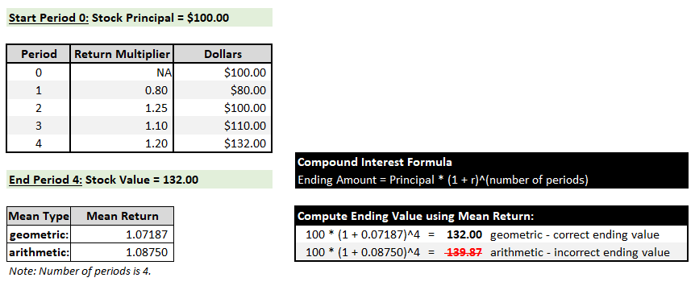
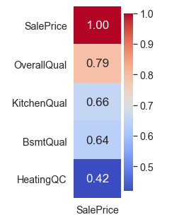
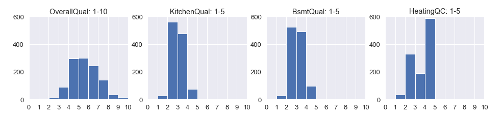
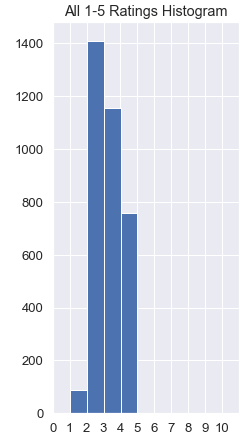
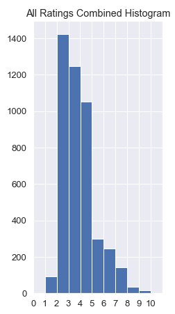
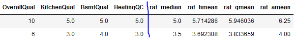

# means_and_outliers
**Build intuition for harmonic, geometric, and arithmetic means.**
***

We commonly summarize many numbers with a single number.  The number is often an average.  Different averages have different properties.  

We will discuss the arithmetic mean, geometric mean, and harmonic mean.  Each behaves differently with non-uniform data. And each has use cases.

The **arithmetic mean** is the "average" everyone is familiar with.  We have two numbers, 40 and 60:

`Arithmetic mean = (40 + 60) / 2 = 50`

***
The **geometric mean** is the nth root of numbers multiplied together, where n is how many numbers.

* `Geometric mean of 40, 60 = (40*60)^(1/2) = 48.9898 (rounded to four decimals)`

* `Geometric mean of 3, 5, 7, 40 = (3*5*7*40)^(1/4) = 8.0503 (rounded to four decimals)`

Geometric mean is best used for multiplicative differences, like compound interest or stock returns.  The example below shows stock ownership for four periods.  The Principal is $100 in Period 0.  The Ending Amount is $132 in Period 4.

The geometric mean computes the correct interest rate for the Compound Interest Formula.  The arithmetic mean computes an *incorrect* rate for the formula.



***
The **harmonic mean** is the **arithmetic mean** but with -1 powers inserted. Each number in the numerator gets -1 power.  Also, the numerator and denominator are placed in parenthesis and raised to the -1 power.  This is the same as flipping the `numerator/denominator` to `denominator/numerator`.

* `Harmonic mean of 40, 60 = ((40^-1+60^-1)/(2))^-1 = 2/(1/40 + 1/60)` = 48

Harmonic mean in words:
* Write out arithmetic mean equation: (40 + 60) / 2; 
* Rewrite equation by putting the denominator as the numerator.  
* Each number in numerator is flipped and summed in the denominator inside parenthesis.

Harmonic mean is used for comparing [rates](https://stats.stackexchange.com/questions/23117/which-mean-to-use-and-when) like Miles Per Hour (credit: Peter Flom).  If you drive roundtrip from Houston to Midland at 40 MPH and return at 60 MPH, what is the average speed?  It is not 50 MPH because the 60 MPH leg takes fewer hours.

The harmonic mean computes the answer directly, as shown in the above example.  The average speed is 48 MPH.

The conventional way to calculate it is speed = roundtrip_distance / roundtrip_time = 480 / 10 = 48.

***
### Quality Ratings on Scales 1-5 and 1-10
Consider a contrived scenario where there are four different house quality ratings.  Only these ratings will be used to predict house price.  Kitchen, Basement, and House Quality are rated on a scale of 1-5 with 5 as the best.  Overall Quality is rated on a scale of 1-10 with 10 as the best.

Each of the four ratings is strongly correlated to SalePrice, especially Overall Quality:



Here are histograms of the ratings:



We mix the 1-5 scale ratings together and view the histogram:



Since the scales are the same, the combined histogram also goes from 1-5.  Now, we mix in the Overall Quality ratings:



The histogram is right-skewed because the Overall Quality scale includes 6-10 and the other ratings do not.  If we pretend this set is [normally distributed](https://www.mathsisfun.com/data/standard-normal-distribution.html), the tails would be balanced.  In this context, the two little bars in the right tail look like outliers.  Ratings 9 and 10 in the set are over three standard deviations above the mean rating of 4.3.

### How are the means impacted by non-uniform data?

We put Overall Quality, Kitchen Quality, Basement Quality and Heating Quality into a table.  The first two rows are shown below.

The four ratings are summarized with the mean.  For example, on the first row, the arithmetic mean (rat_amean) is 6.25.  The geometric mean is 5.95 (rat_gmean).  The harmonic mean (rat_hmean) is 5.71.  Also, the median (rat_median) is 5.0.



The means follow an order.  Arithmetic >= Geometric >= Harmonic.  This is always true, unless the data is completely uniform!

### How is a linear regression impacted by using the mean?

Let's predict house price by first using our original four ratings:  Overall Quality, Kitchen Quality, Basement Quality and Heating Quality.  Mean Absolute Error (MAE) scores the predictions.  (MAE is an arithmetic mean by convention.)

```
# Regression with rating columns.
rating_cols = ['OverallQual','KitchenQual','BsmtQual','HeatingQC']
           
lr=LinearRegression(fit_intercept=True)
lr.fit(X_train[rating_cols], y_train)
y_preds = lr.predict(X_test[rating_cols])
score_results(lr, y_test, y_preds)

-----------------------------------------------
##### LinearRegression - Ratings
-----------------------------------------------
R^2: 0.6929
MAE: 29152.54
```

Now, regress on each mean column by itself.

```
# Regression with mean columns
mean_col = ['rat_amean', 'rat_gmean', 'rat_hmean','rat_median']
lr=LinearRegression(fit_intercept=True)

for c in mean_col: 
    lr.fit(X_train[c].values.reshape(-1,1), y_train)
    y_predsAvg = lr.predict(X_test[c].values.reshape(-1,1))    
    score_results(lr, y_test, y_predsAvg)
    print('Average column:', c,'\n')
    
-----------------------------------------------
##### LinearRegression - rat_amean
-----------------------------------------------
R^2: 0.6345
MAE: 32350.11

-----------------------------------------------
##### LinearRegression - rat_gmean
-----------------------------------------------
R^2: 0.6044
MAE: 33762.05

-----------------------------------------------
##### LinearRegression - rat_hmean
-----------------------------------------------
R^2: 0.5771
MAE: 34956.29

-----------------------------------------------
##### LinearRegression - rat_median
-----------------------------------------------
R^2: 0.3915
MAE: 42603.38
```
As expected, prediction quality worsens regardless of which statistic is used.  Taking the mean of four ratings removes information.

The best to worst prediction order mirrors the mean order!  The order is: 

* 1st: Arithmetic
* 2nd: Geometric
* 3rd: Harmonic
